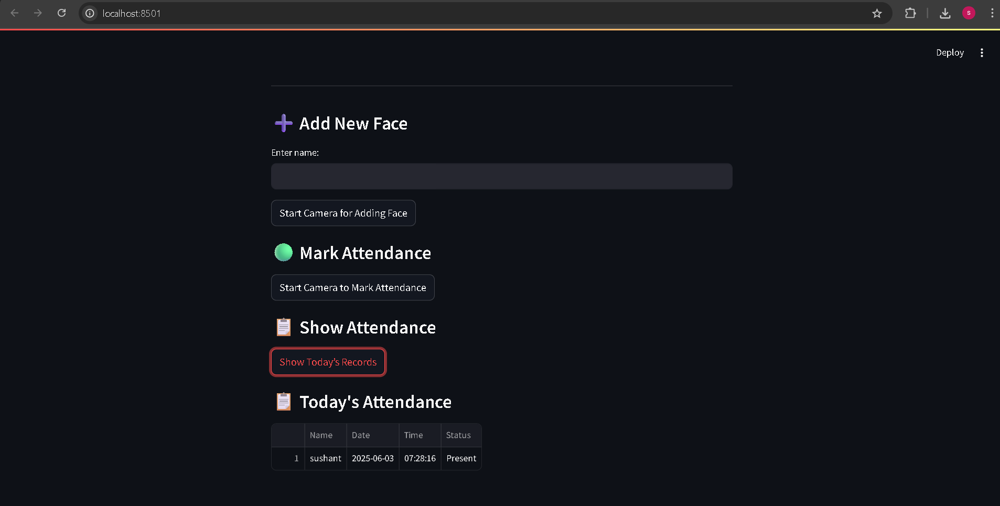

# 🎓 Smart Face Recognition Attendance System

An AI-powered attendance system using real-time face detection, FaceNet embeddings, and Streamlit UI. Add new faces, mark attendance through the webcam, and view attendance logs – all from a simple interface.

---

## ✅ Features

- **Real-time webcam integration**
- **Face detection using Haar Cascade**
- **Face embedding with pretrained FaceNet model**
- **Attendance logging with date and time**
- **Streamlit front-end UI**
- **CSV-based storage (no database required)**
- **EXE packaging and GitHub-ready**

---

## 💻 Tech Stack

| Tool | Purpose |
|------|---------|
| Python | Programming Language |
| OpenCV | Webcam + face detection |
| Streamlit | Web UI |
| FaceNet (facenet-pytorch) | Face embedding |
| Scikit-learn | Cosine similarity matching |
| Pandas | Attendance logging (CSV) |

---

## 📁 Project Structure

```
attendance_system/
├── main.py
├── modules/
│   ├── add_face.py
│   ├── recognize.py
│   ├── embedding_utils.py
│   └── show_attendance.py
├── embeddings/
├── attendance.csv
├── requirements.txt
└── README.md
```

---

## 🚀 How to Run

1. Install dependencies:
    ```
    pip install -r requirements.txt
    ```

2. Run the app:
    ```
    streamlit run main.py
    ```

3. Use the buttons to:
    - Add a new face
    - Mark attendance
    - Show attendance log

---

## 📦 EXE (Coming Soon)

This project can be packaged as a standalone Windows `.exe` using PyInstaller.

---

## 🚧 Future Improvements
- Add database (e.g., MySQL) instead of CSV
- Liveness detection (prevent photo spoofing)
- Mobile camera integration
- Cloud deployment


## 🧠 Notes

- Uses pretrained FaceNet model for embeddings
- Matches faces via cosine similarity
- Works fully offline
- Only one attendance entry per user per day

---

## 📸 Demo Screenshot



---

## 👤 Author

- **Sushant Mutnale ** – AI/ML Enthusiast  3rd Year Computer Science Student 
- Connect on [LinkedIn](https://www.linkedin.com/in/sushant-mutnale/)
📧 sbmutnale512@gmail.com

---

## 📃 License

MIT License
